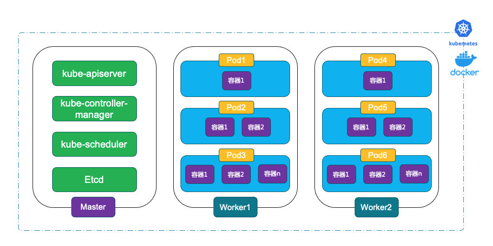
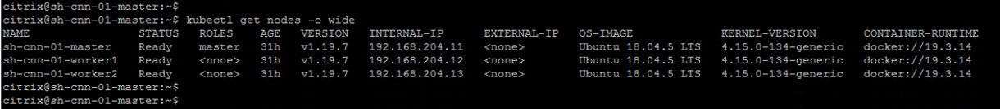

# LAB02: Kubernetes基本应用与部署

## 更新时间

2021.01.24

## 1. 实验拓扑


## 2. 基本概念



| Docker名称 | 说明                                                         |
| ---------- | ------------------------------------------------------------ |
| Image      | 容器的模版，docker把应用及其依赖打包放入image文件            |
| Container  | docker根据image生成容器的实例，同一个 image 文件，可以生成多个同时运行的容器实例 |
| Repository | 默认为公共仓库(Docker Hub)，Docker Registry中可以包含多个Repository(可以自定义其它公共仓库或私有仓库) |

| Kubernetes名称 | 说明                                                         |
| -------------- | ------------------------------------------------------------ |
| Master         | Kubernetes集群控制和管理节点                                 |
| Node           | 除了Master节点外，Kubernetes集群中所有节点都被称为Node, Node才是Kubernetes中工作负载节点 |
| namespace      | 逻辑分区对象，实现多租户。系统对象的namespace默认为"kube-system"，用户对象的namespace默认为"default" |
| pod            | 应用部署的最小部署单元，一个Pod由一个或多个Container组成，Container共享存储和网络资源，在同一台Node上运行 |
| deployment     | kubernetes在多个Node上部署pod副本，支持弹性扩容、负载均衡、版本管理、金丝雀等 |
| service        | 微服务，对指定的pod或deployment进行服务发现，对外表现为一个访问入口 |
| CRD            | 自定义资源，当创建一个非内置资源的时候，需要一个CRD的描述文件 |
| annotation     | 是 key/value 形式附加于对象的注解。用来记录一些附加信息，用来辅助应用部署、安全策略以及调度策略等 |

| Service类型                                     | 说明                                                         |
| ----------------------------------------------- | ------------------------------------------------------------ |
| ClusterIP                                       | 默认方式，通过Cluster VIP来访问                              |
| NodePort                                        | 通过Node地址上端口映射来访问                                 |
| Loadbalancer-OnPremise                          | OnPremise等同于NodePort（除非使用额外的方案例如IPAM Controller或metal LB来分配地址） |
| Loadbalancer-Cloud Provider Kubernetes Clusters | Azure Load Balancer, AWS Elastic Load Balancer, GCP Load Balancer等云端LB方式 |
| External Name                                   | 映射到DNS解析                                                |

## 3. Demo(1): 部署一个Nginx应用

SSH命令登录到Master节点，然后检查集群创建

运行命令

```
kubectl get nodes -o wide
```



基于nginx的latest镜像，创建一个新的pod应用，名称为"citrix101-lab02-demo1"

```
kubectl run citrix101-lab02-demo1 --image=nginx
```


查看pod运行状态

```
kubectl get pods
kubectl get pods -o wide
```


查看pod创建过程

```
kubectl describe pod citrix101-lab02-demo1
```


SSH到2个Node节点（Worker1, Worker2)，然后查看当前正在运行的container信息

```
sudo docker container ls -a | grep nginx
```


删除这个pod

```
kubectl delete pods citrix101-lab02-demo1
kubectl get pods -A
```


## 4. Demo(2): 通过yaml文件部署一个Nginx应用

SSH登录到Master节点，然后查看本地yaml配置文件"citrix101-lab02-demo02.yaml"

```
cat citrix101-lab02-demo02.yaml
```


使用yaml配置文件部署pod应用

```
kubectl apply -f citrix101-lab02-demo02.yaml
```


查看pod运行状态

```
kubectl get pods -A -o wide
```


通过curl命令查看nginx应用访问

```
curl -i http://10.36.0.1
```


删除pod应用

```
kubectl delete -f citrix101-lab02-demo02.yaml
kubectl get pods -A
```


## 4. Demo(3): 通过deployment部署一个Nginx应用

SSH登录到Master节点，然后查看本地yaml配置文件"citrix101-lab02-demo03.yaml"

```
cat citrix101-lab02-demo03.yaml
```


使用yaml部署新的应用

```
kubectl apply -f citrix101-lab02-demo03.yaml
kubectl get pods -o wide
kubectl get deployments -o wide
```


通过curl命令分别查看2个副本的业务访问

```
curl http://10.36.0.1
curl http://10.44.0.1
```


## 5. Demo(4): 通过service实现负载均衡和集群内访问应用

通过expose为deployment配置ClusterIP类型的服务

```
kubectl expose deployment citrix101-lab02-demo03 --type=ClusterIP --name=citrix101-lab02-demo03-clusterip
kubectl get svc
kubectl get svc -o wide
```


通过curl命令访问Cluster-IP检查应用访问，尝试多次然后比较一下输出结果

```
curl http://10.107.26.254
...
curl http://10.107.26.254
```


## 6. Demo(5): 通过service实现负载均衡和集群外访问应用

通过expose为deployment配置NodePort类型的服务

```
kubectl expose deployment citrix101-lab02-demo03 --type=NodePort --name=citrix101-lab02-demo03-nodeport --port=81 --target-port=80
kubectl get svc
kubectl get svc -o wide
```


在集群外的Pod-Network设备上通过curl命令访问集群的Node IP检查应用访问，尝试多次然后比较一下输出结果

```
curl http://192.168.204.11:30052
...
curl http://192.168.204.11:30052
```


在Master节点上通过curl命令访问Cluster-IP和指定端口81检查应用访问，尝试多次然后比较一下输出结果

```
curl http://10.101.41.135:81
...
curl http://10.101.41.135:81
```


至此，我们完成了Kubernetes应用发布、部署、集群内负载均衡访问、集群外负载均衡访问等。