# LAB03: 统一入口部署模式(Unified Ingress)

## 更新时间

2021.02.28

## 1. 实验拓扑


## 2. Demo(1): 使用deployment部署一个Nginx应用

SSH登录到Master节点，然后查看yaml文件"citrix101-lab03-demo01.yaml"

```
cat citrix101-lab03-demo01.yaml
```


通过这个yaml文件部署一个新的资源，然后查看pod和deployment信息

```
kubectl apply -f citrix101-lab03-demo01.yaml
kubectl get pods -o wide
kubectl get deployments -o wide
```


通过deployment进行业务扩容：副本扩大为4个，然后查看pod和deployment信息

```
kubectl scale deployment citrix101-lab03-demo01 --replicas 4
kubectl get pods -o wide
kubectl get deployments -o wide
```

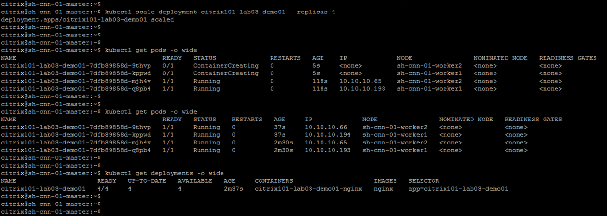

通过curl命令访问这4个Pod IP地址，确认业务访问

```
curl http://10.10.10.65
curl http://10.10.10.66
curl http://10.10.10.193
curl http://10.10.10.194
```

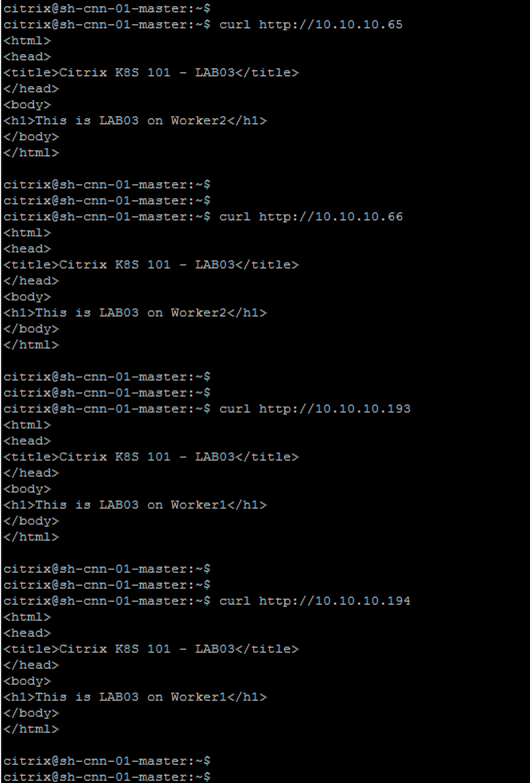

## 3. Demo(2): 使用Citrix ADC(VPX)实现4层负载均衡

分别SSH登录到Worker1和Worker2这两个Node，然后查看Pod Network信息

```
ifconfig weave
ip route | grep weave
```

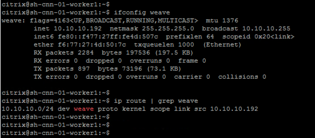


登录到Citrix ADC(VPX)设备，然后创建新的网络路由，实现Citrix ADC到Pod Network路由可达

访问菜单: Configuration -> System -> Network -> Routes -> Basic

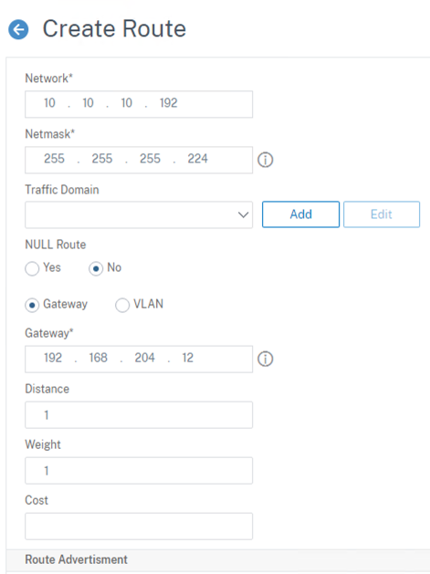

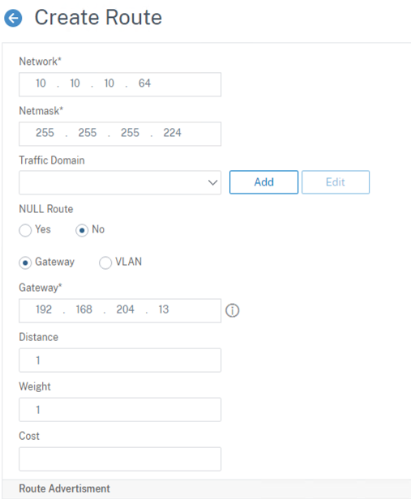

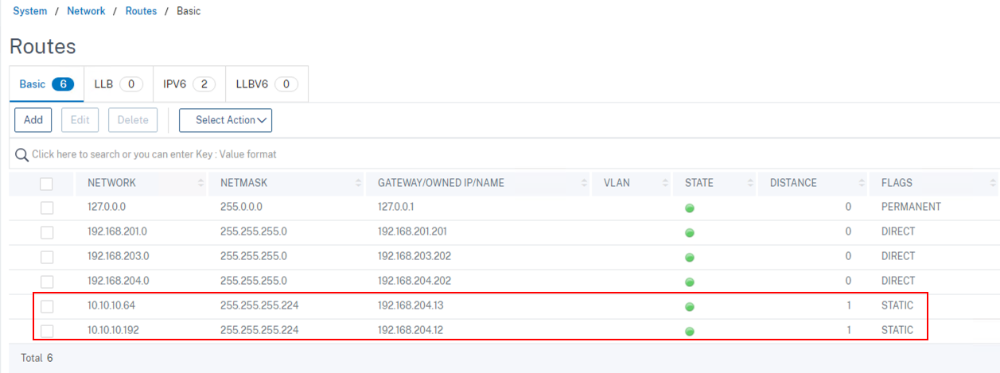

访问Citrix ADC(VPX)设备的菜单: Configuration -> Traffic Management -> Load Balancing -> Servers，创建4个后端服务器配置


访问Citrix ADC(VPX)设备的菜单: Configuration -> Traffic Management -> Load Balancing -> Services，创建针对这4台后端服务器的80端口服务

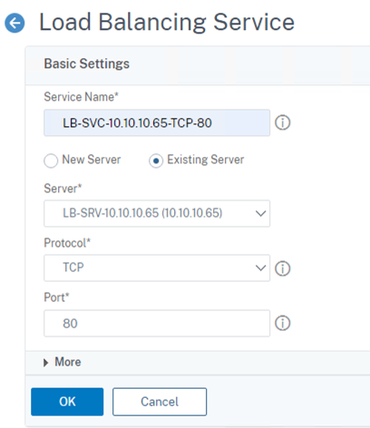


访问Citrix ADC(VPX)设备的菜单: Configuration -> Traffic Management -> Load Balancing -> Virtual Servers，创建VIP并绑定4个后端服务，修改负载均衡算法为"RoundRobin"

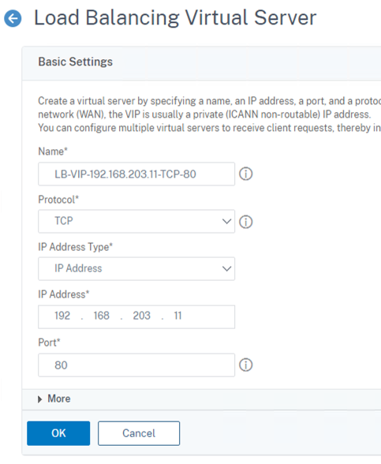


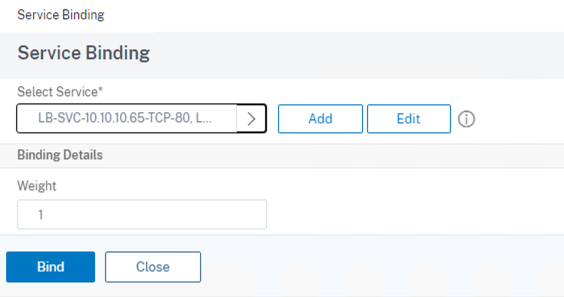

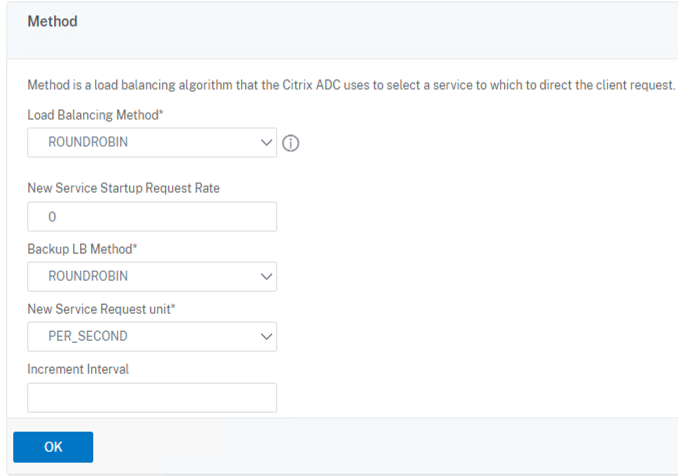


打开Student客户端的浏览器，访问VIP地址: http://192.168.203.11


打开Student客户端的命令行窗口，使用ab命令进行压力测试

```
cd C:\SH-CNN-Tools\Apache22\bin
ab -n 10 -c 10 -t 30 http://192.168.203.11/index.html
```


测试完成后，查看VIP上负载均衡后端服务器的统计信息

访问Citrix ADC(VPX)设备的菜单: Configuration -> Traffic Management -> Load Balancing -> Virtual Servers，选中VIP，然后点击"Statistics"


## 4. Demo(3): 使用Citrix ADC(VPX)实现7层负载均衡

SSH登录到Master节点，然后通过deployment对"citrix101-lab03-demo01"扩容，增加2个pod

```
kubectl scale deployment citrix101-lab03-demo01 --replicas 6
kubectl get pods -o wide
kubectl get deployments -o wide
```


访问Citrix ADC(VPX)设备的菜单: Configuration -> Traffic Management -> Load Balancing -> Servers，创建新的2台后端服务器

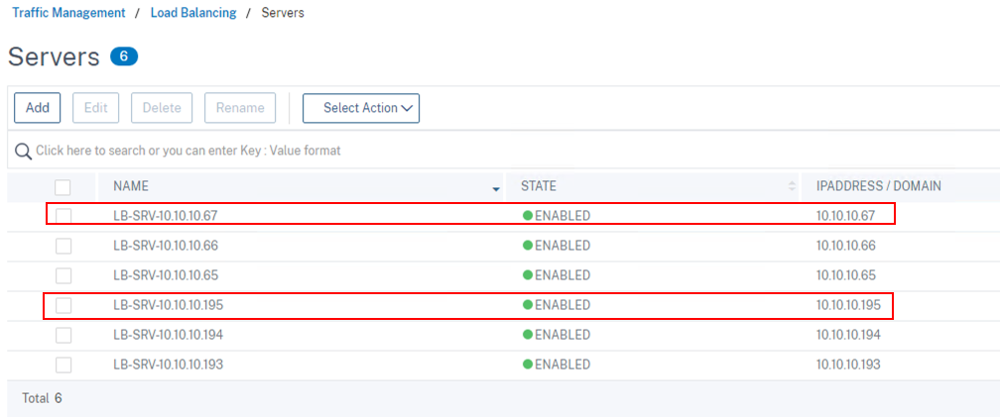

访问Citrix ADC(VPX)设备的菜单: Configuration -> Traffic Management -> Load Balancing -> Services，创建新的HTTP服务，端口为80


访问Citrix ADC(VPX)设备的菜单: Configuration -> Traffic Management -> Load Balancing -> Virtual Servers，创建新的HTTP VIP并不绑定VIP地址，然后绑定指定Worker节点上的后端服务


访问Citrix ADC(VPX)设备的菜单: Configuration -> Traffic Management -> Content Switching -> Virtual Servers，创建新的HTTP VIP配置


访问Citrix ADC(VPX)设备的菜单: Configuration -> Traffic Management -> Content Switching -> Actions，创建2个Action并绑定到2个Load Balancing VIP


访问Citrix ADC(VPX)设备的菜单: Configuration -> Traffic Management -> Content Switching -> Policies，自定义URL路径的策略


访问Citrix ADC(VPX)设备的菜单: Configuration -> Traffic Management -> Content Switching -> Virtual Servers，打开刚才创建的VIP，然后绑定这2个Policy


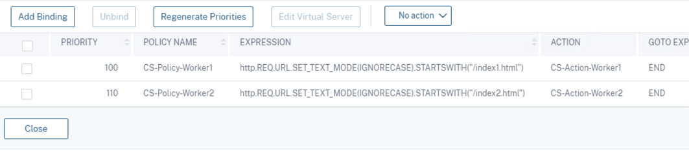

打开Student客户端的浏览器，然后分别访问这2个URL，查看和比较输出内容

```
http://192.168.203.12/index1.html
http://192.168.203.12/index2.html
```


## 5. Demo(4): 使用Citrix ADC(VPX)实现SSL/TLS流量卸载

访问Citrix ADC(VPX)设备的菜单: Configuration -> Traffic Management -> Load Balancing -> Virtual Servers，创建新的HTTPS VIP配置


点击"Service Binding"，绑定后端2个HTTP服务


点击"Server Certificate"，绑定SSL证书


打开Student客户端浏览器，访问https://192.168.203.13


## 6. Demo(5): 使用Citrix Ingress Controller和Annotation实现配置自动化

SSH登录到Master节点，然后通过deployment基于yaml文件"citrix101-lab03-demo05.yaml"部署一个新的应用

```
kubectl apply -f citrix101-lab03-demo05.yaml
```


对该应用创建一个新的Service，使用NodeType方式

```
kubectl expose deployment citrix101-lab03-demo05 --type=NodePort --name=citrix101-lab03-demo05-nodeport --port=8080 --target-port=80
kubectl get svc -o wide
curl http://10.106.185.244:8080
curl http://192.168.204.12:31321
```


创建一个新的secret存储Citrix ADC(VPX)的管理账号

```
kubectl create secret  generic nslogin --from-literal=username='nsroot' --from-literal=password='******'
```


查看Citrix Ingress Controller的yaml配置文件"citrix101-lab03-demo05-cic-k8s-ingress-controller-vpx.yaml"，留意Prefix和Ingress Class的值

```
cat citrix101-lab03-demo05-cic-k8s-ingress-controller-vpx.yaml
```


部署这个yaml文件，然后查看pod信息

```
kubectl apply -f citrix101-lab03-demo05-cic-k8s-ingress-controller-vpx.yaml
kubectl get deployments -o wide
kubectl get pods -o wide
```

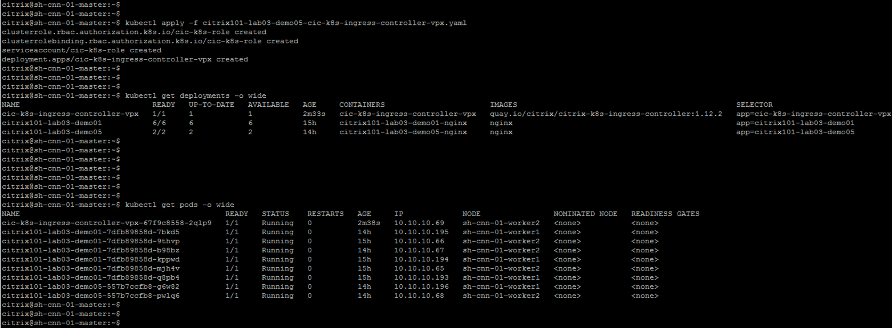

查看ingress配置文件"citrix101-lab03-demo05-ingress.yaml"，在这个yaml文件里面通过Annotation功能配置了Load Balancing的VIP地址信息并关联ingress.class为"citrix"

```
cat citrix101-lab03-demo05-ingress.yaml
```


部署ingress配置，然后查看运行状态

```
kubectl apply -f citrix101-lab03-demo05-ingress.yaml
kubectl get ingress -o wide
```

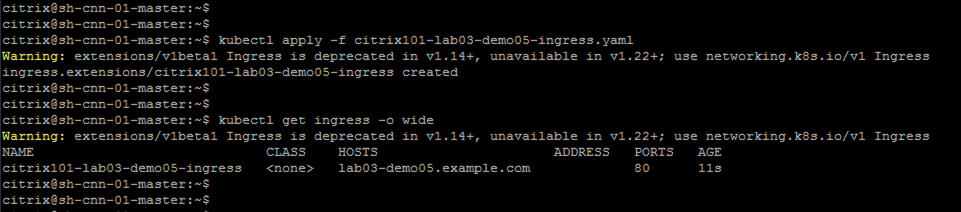

登录Citrix ADC(VPX)的管理界面，查看Load Balancing VIP, Load Balancing Service Group, Load Balancing Server, Content Switch VIP配置已经自动完成


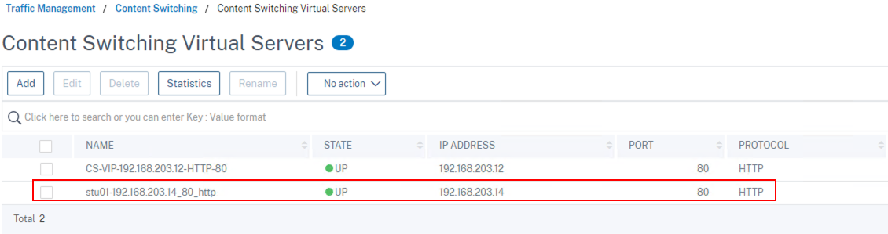

打开Student客户端的C:\Windows\system32\drivers\hosts文件，然后绑定一个静态域名解析"lab03-demo05.example.com"


打开Student客户端浏览器，然后输入域名访问: http://lab03-demo05.example.com


