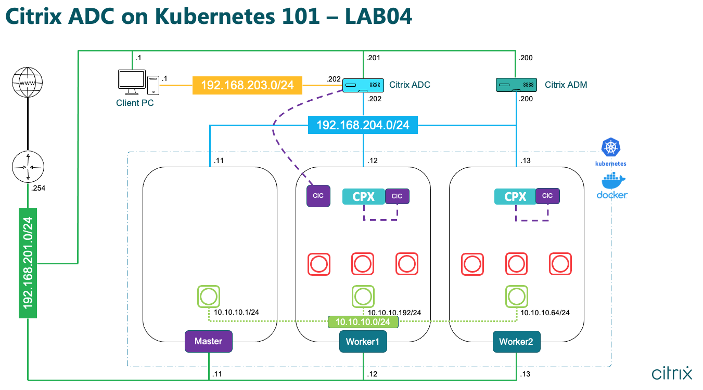
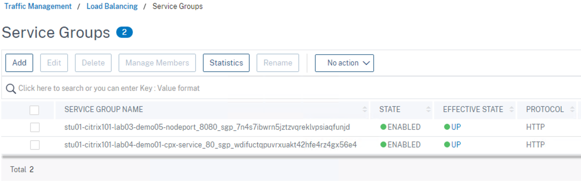

# LAB04: 两层式负载均衡部署模式(Dual Tier)

## 更新时间

2021.01.27

## 1. 实验拓扑



## 2. Demo(1): 通过Dual Tier模式部署一个Nginx应用

SSH登录到Master节点，然后查看yaml配置文件"citrix101-lab04-demo01.yaml"并部署

```
cat citrix101-lab04-demo01.yaml
kubectl apply -f citrix101-lab04-demo01.yaml
```


查看pod和deployment运行状态

```
kubectl get pods -o wide -l app=citrix101-lab04-demo01
kubectl get deployments -o wide -l app=citrix101-lab04-demo01
```


部署新的Service，通过ClusterIP方式实现集群内访问

```
kubectl expose deployment citrix101-lab04-demo01 --type=ClusterIP --name=citrix101-lab04-demo01-clusterip
kubectl get svc -o wide
```


查看并部署ingress的yaml配置文件"citrix101-lab04-demo01-ingress.yaml"，注意"kubernetes.io/ingress.class"为"cpx"，此ingress用于Tier-2的CPX设备实现流量管理

```
cat citrix101-lab04-demo01-ingress.yaml
kubectl apply -f citrix101-lab04-demo01-ingress.yaml
kubectl get ingress0 -o wide
```


查看CPX和CIC的yaml配置文件，注意这个CIC使用了sidecar方式部署并且不需要认证信息

```
cat citrix-k8s-ingress-controller-cpx-cic.yaml
```


部署这个yaml文件，然后查看pod, deployment, service运行状态

```
kubectl apply -f citrix-k8s-ingress-controller-cpx-cic.yaml
kubectl get deployments -o wide -l app=citrix101-lab04-demo01-cpx-ingress
kubectl get pods -o wide -l app=citrix101-lab04-demo01-cpx-ingress
kubectl get svc -o wide -l app=citrix101-lab04-demo01-cpx-service
```


查看并部署ingress的yaml配置文件"citrix101-lab04-demo01-ingress-vpx.yaml"，注意"kubernetes.io/ingress.class"为"Citrix"，此ingress用于Tier-1的VPX设备实现流量管理

```
cat citrix101-lab04-demo01-ingress-vpx.yaml
kubectl apply -f citrix101-lab04-demo01-ingress-vpx.yaml
kubectl get ingress -o wide
```


打开Student客户端的C:\Windows\system32\drivers\hosts文件，然后绑定一个静态域名解析"lab04-demo01.example.com"


打开Student客户端的浏览器， 然后访问域名: http://lab04-demo01.example.com


打开Student客户端的浏览器，登录到Citrix ADC(VPX)管理界面，查看相关配置，发现配置已经自动完成





## 3. Demo(2): 一键配置安全策略 (CRD)

打开Student客户端的浏览器， 然后访问域名: http://lab04-demo01.example.com/test


SSH登录到Master节点，然后查看和部署Citrix CRD自定义资源"citrix101-lab04-demo02-crd.yaml"

```
cat citrix-lab04-demo02-crd.yaml
kubectl apply -f citrix-lab04-demo02-crd.yaml
kubectl get customresourcedefinitions -o wide
```


查看和部署Responder策略“citrix101-lab04-demo02-blacklisturls.yaml"，阻止访问/test目录

```
cat citrix101-lab04-demo02-blacklisturls.yaml
kubectl apply -f citrix101-lab04-demo02-blacklisturls.yaml
```


直接使用kubectl命令即可查看自定义资源的运行状态，这也是CRD和ConfigMap最大的区别

```
kubectl get rewritepolicies.citrix.com -o wide
```


打开Student客户端的浏览器， 再次访问域名: http://lab04-demo01.example.com/test


